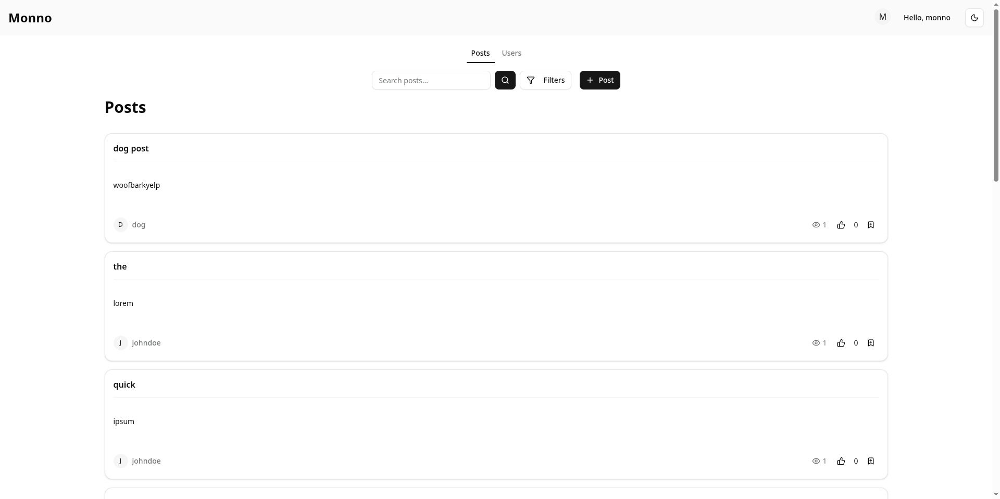

# Monno

**[Live Demo](https://willmarl.github.io/monno-demo/)** — fully static, no backend required (any credentials work, data resets on refresh)

A full-stack CRUD boilerplate with auth. This is a mono repo that uses nestjs for backend and nextjs for frontend. (its where repo name comes from "Monno" = Mono repo + (nn == nextjs + nestjs))

## what's included

- **backend**: nestjs api with prisma orm, rate limiting, swagger docs, file uploads, stripe integration, email sending, session management with geolocation & risk scoring
- **frontend**: nextjs with shadcn/ui, tanstack query, form validation, avatar editor, rich tables & data visualization
- **worker**: bullmq jobs for email sending and session cleanup
- **database**: postgresql with redis caching (using docker compose)
- **auth**: username/password (email optional), oauth (google/github), 2-token system (refresh + access), role-based access
- **admin dashboard**: manage users, posts, comments, audit logs, support tickets
- **tests**: 123 unit tests, 80 integration tests (real DB), 16 api tests, 12 e2e tests with playwright
- **ai scaffolding**: CLI + guides for adding new CRUD resources with AI without hallucination (`pnpm run crud`), plus `/write-tests` slash command for generating integration tests with BV/EP/pairwise coverage

## quick start

1. clone the repo
2. `pnpm i`
3. rename `.env.template` files (remove "template" from filename)
4. fill in your env vars (look at setup.md for details)
5. `pnpm run db:up` to start docker services
6. run migrations: `cd apps/api && pnpm prisma migrate deploy && pnpm prisma generate`
7. same for worker: `cd apps/worker && pnpm prisma migrate deploy && pnpm prisma generate`
8. `pnpm run dev` to start everything (or separate terminals per app, i prefer that)

api docs at http://localhost:3001/docs

see [setup.md](./setup.md) for full details

## documentation

- [setup.md](./setup.md) - dev environment setup, building, and deployment
- [features.md](./features.md) - feature overview and what's actually implemented
- [screenshots.md](./screenshots.md) - visual overview of the app with embedded screenshots
- [tests.md](./tests.md) - how to run tests and coverage status
- [futureToDo.md](./futureToDo.md) - planned features for v2
- [ai-tut.md](./ai-tut.md) - how to use AI to scaffold new CRUD resources (`pnpm run crud`)

## why this exists

i originally wanted to learn nextjs but i hate nextjs server actions/ its "backend" equivalent, so i started to learn nestjs. for context i already know MERN but i think MERN is dead like every web related news i hear is nextjs, i haven't heard MERN in a long time. the idea of boilerplate repo came up when i was taking notes on how to setup auth system and was like "im going to do this on every single app i make, i mind as well make a template for it" so i stuffed monno with all the features i think i would use anytime i make new website
